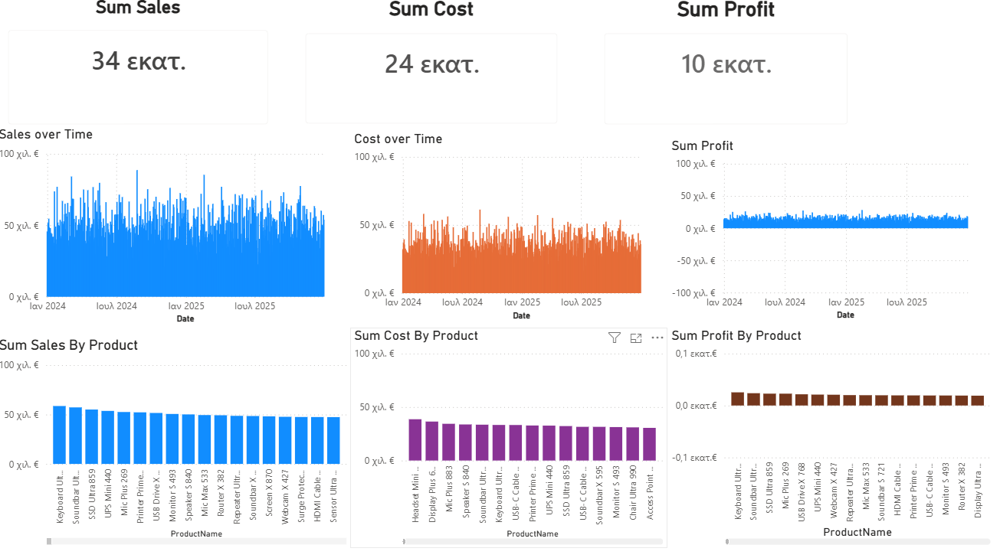
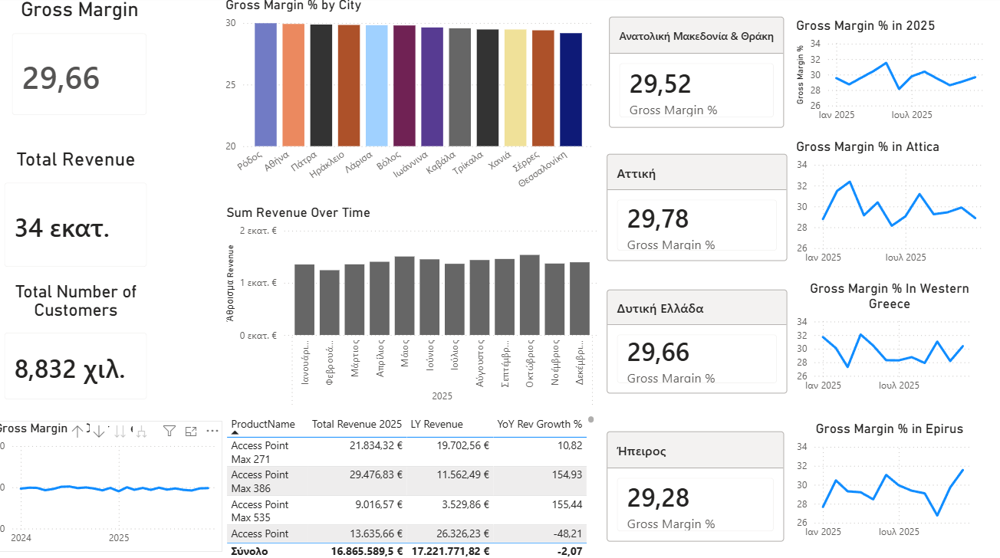
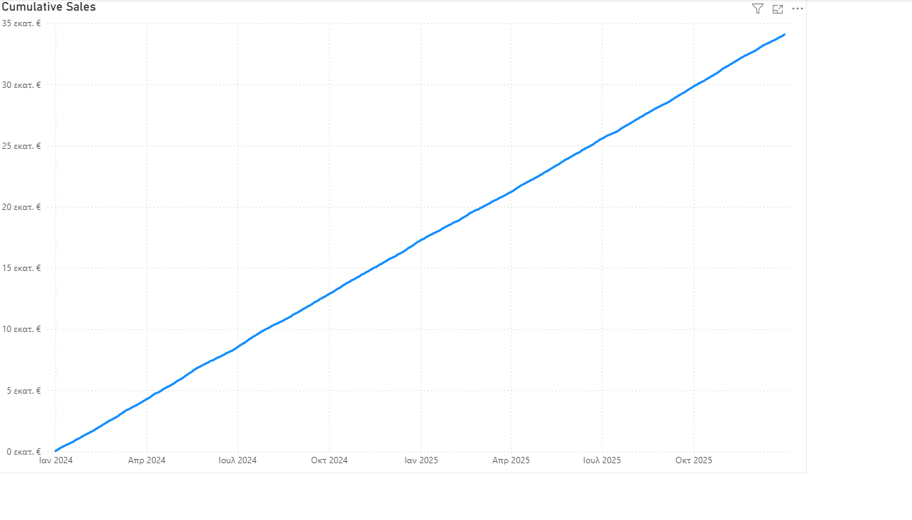
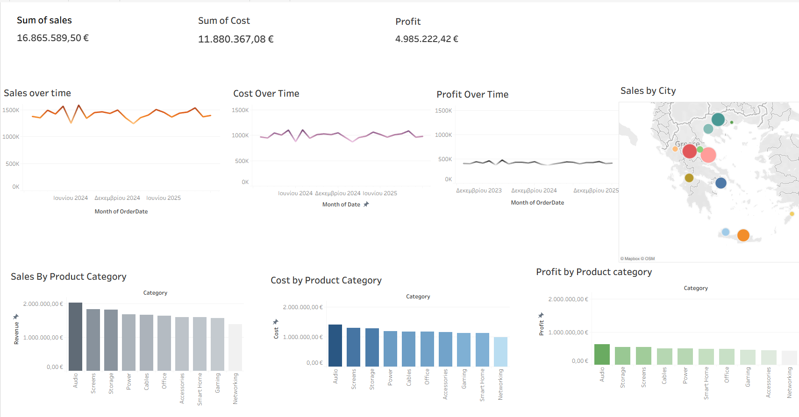

# 📊 TechSales BI Dashboard — Power BI & Tableau

**End-to-end sales analytics project** for a fictional Greek technology retailer, built in both **Power BI** and **Tableau**. Covers the full analytics pipeline: star schema data modelling → DAX measures → multi-page interactive reporting.


---

## 📋 Table of Contents
- [Business Context](#business-context)
- [Data Model](#data-model)
- [Dashboard Overview](#dashboard-overview)
- [DAX Measures](#dax-measures)
- [Key Insights](#key-insights)
- [Tools & Technologies](#tools--technologies)
- [Repository Structure](#repository-structure)
- [How to Use](#how-to-use)

---

## 🏢 Business Context

A Greek consumer electronics retailer with operations across **8 regional markets** seeks to understand:

- Which products and regions drive revenue and profit?
- How is the business trending year-over-year?
- Where are margins under pressure?
- What is the contribution of each sales channel?

This project answers these questions through two parallel BI implementations — one in Power BI (4-page report) and one in Tableau — built on the same underlying dataset.

---

## 🗄️ Data Model

The project uses a **star schema** with one fact table and three dimension tables:

```
                    ┌──────────────┐
                    │  dim_date    │
                    │  1,096 rows  │
                    └──────┬───────┘
                           │
┌──────────────┐    ┌──────┴────────────────┐    ┌───────────────┐
│ dim_products │    │     fact_sales         │    │ dim_customers │
│  2,000 rows  ├────┤     60,000 rows        ├────┤  10,000 rows  │
└──────────────┘    │  Jan 2024 – Sep 2025   │    └───────────────┘
                    └────────────────────────┘
```

| Table | File | Rows | Key Fields |
|---|---|---|---|
| `fact_sales` | `fact_sales.csv` | 60,000 | OrderID, Revenue, Cost, Profit, Channel, Region |
| `dim_date` | `dim_date.csv` | 1,096 | Date, Year, Month, Quarter, IsWeekend |
| `dim_customers` | `dim_customers.csv` | 10,000 | CustomerID, Segment, Age, Gender, Region |
| `dim_products` | `dim_products.csv` | 2,000 | ProductID, ProductName, Category, Brand |

**Sales channels:** Online (55%) · In-Store (35%) · B2B (10%)  
**Regions covered:** Θεσσαλία · Κεντρική Μακεδονία · Κρήτη · Αττική · Ήπειρος · Δυτική Ελλάδα · Νότιο Αιγαίο · Ανατολική Μακεδονία & Θράκη  
**Product categories:** Screens · Cables · Gaming · Audio · Storage · Networking · Smart Home · Office · Accessories · Power  
**Customer segments:** Bronze · Silver · Gold · Platinum

---

## 📈 Dashboard Overview

### Power BI — 4-Page Report

#### Page 1 — Executive Summary
High-level KPIs with time series for Sales, Cost, and Profit, plus product-level bar charts.



#### Page 2 — Gross Margin Analysis
Regional Gross Margin % comparison, YoY Revenue Growth by product, and sparklines per region.



#### Page 3 — Cumulative Sales
Running total of revenue across the full 21-month period (Jan 2024 – Sep 2025).



#### Page 4 — [Additional Analysis]


---

### Tableau — Sales & Profitability Dashboard

Multi-view dashboard covering Sales over Time, Cost over Time, Profit over Time, and ranked bar charts by product.



---

## 🧮 DAX Measures

All custom measures used in the Power BI report are documented below.

### Core Financials

```dax
-- Total Revenue
Total Revenue = SUM(fact_sales[Revenue])

-- Total Cost
Total Cost = SUM(fact_sales[Cost])

-- Total Profit
Total Profit = SUM(fact_sales[Profit])
```

### Profitability

```dax
-- Gross Margin %
Gross Margin % =
DIVIDE(
    [Total Profit],
    [Total Revenue],
    0
)

-- Gross Margin % formatted
Gross Margin % Display =
FORMAT([Gross Margin %], "0.00%")
```

### Year-over-Year Analysis

```dax
-- Last Year Revenue
LY Revenue =
CALCULATE(
    [Total Revenue],
    SAMEPERIODLASTYEAR(dim_date[Date])
)

-- YoY Revenue Growth %
YoY Rev Growth % =
DIVIDE(
    [Total Revenue] - [LY Revenue],
    [LY Revenue],
    0
)
```

### Time Intelligence

```dax
-- Cumulative Sales (Running Total)
Cumulative Sales =
CALCULATE(
    [Total Revenue],
    DATESYTD(dim_date[Date])
)

-- Month-to-Date Revenue
MTD Revenue =
CALCULATE(
    [Total Revenue],
    DATESMTD(dim_date[Date])
)
```

---

## 💡 Key Insights

1. **Gross Margin is stable at ~29.7% nationally**, ranging from 29.28% (Ήπειρος) to 29.78% (Αττική) — minimal regional variation suggests consistent pricing strategy.

2. **Online is the dominant channel (55% of orders)**, confirming the channel as the primary growth driver — consistent with the analytical finding from the ProfitLens project.

3. **Θεσσαλία accounts for 26% of all transactions** — the highest regional volume by a significant margin, driven by a large share of the customer base.

4. **Cumulative revenue grows steadily** from €0 in Jan 2024 to ~€35M by Sep 2025, indicating healthy, consistent demand without major seasonal shocks.

5. **YoY growth varies sharply at the product level** — Access Point Max 386 grew +155% YoY while Access Point Max 271 grew only +11%, highlighting the importance of product-level analysis over category averages.

---

## 🛠️ Tools & Technologies

| Tool | Purpose |
|---|---|
| **Power BI Desktop** | Data modelling, DAX measures, 4-page interactive report |
| **Power Query (M)** | Data transformation and type cleaning |
| **DAX** | KPI calculations, time intelligence, YoY comparisons |
| **Tableau Public** | Parallel BI implementation, time series and ranking visuals |
| **CSV / Star Schema** | 4-table dimensional model (1 fact + 3 dim) |

---

## 📁 Repository Structure

```
TechSales-BI-Dashboard/
│
├── README.md                        ← You are here
│
├── powerbi/
│   └── TechSales_Dashboard.pbix    ← Full Power BI report (4 pages)
│
├── tableau/
│   └── TechSales_Dashboard.twbx    ← Tableau workbook
│
├── data/
│   └── raw/
│       ├── fact_sales.csv          ← 60,000 sales transactions
│       ├── dim_date.csv            ← Date dimension (1,096 days)
│       ├── dim_customers.csv       ← 10,000 customer records
│       └── dim_products.csv        ← 2,000 product SKUs
│
├── images/
│   ├── powerbi/                    ← Power BI page screenshots
│   └── tableau/                    ← Tableau dashboard screenshots
│
└── docs/
    ├── data_dictionary.md          ← Field definitions for all tables
    └── dax_measures.md             ← All DAX measures with descriptions
```

---

## 🚀 How to Use

### Power BI
1. Download `powerbi/TechSales_Dashboard.pbix`
2. Open in **Power BI Desktop** (free — [download here](https://powerbi.microsoft.com/desktop/))
3. Data is embedded — no reconnection needed

### Tableau
1. Download `tableau/TechSales_Dashboard.twbx`
2. Open in **Tableau Desktop** or **Tableau Public** (free — [download here](https://public.tableau.com/))
3. Packaged workbook includes all data

### Data only
The `data/raw/` folder contains all four CSV files if you want to reproduce the model in another tool (e.g. Looker Studio, Excel, Python).

---

## 👤 About

**Nikos Antonopoulos** — Data Analyst  
[GitHub](https://github.com/wttbfpf-prog) · [LinkedIn](https://www.linkedin.com/in/nikos-antonopoulos-231167321/)

*Other projects: [ProfitLens — Python Sales Analysis](https://github.com/wttbfpf-prog/ProfitLens-Sales-Analysis) · [Archaeological Finds SQL & Tableau](https://github.com/wttbfpf-prog/archaeological-finds-sql)*
